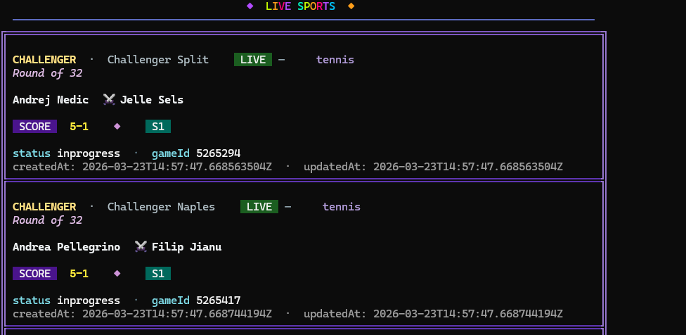

# Polymarket Sports Copy Trading Bot

[](https://www.typescriptlang.org/) [](https://nodejs.org/) [](https://opensource.org/licenses/ISC)

Picture the slate: NFL Sunday bleeding into the West Coast game, Champions League midweek, NBA playoffs where every possession re-prices the book. On Polymarket the sports books move like real sportsbooks—except the tape is public, on-chain, and brutally fast.

You did the work. You read the injury report, you liked the matchup, you took the side that *felt* sharp. You clicked **Yes** at a price that looked fair. Then the live line did what live lines do: it walked away from you. Your ticket is underwater before the half, and somewhere in the order book a wallet you don’t recognize clipped the move on the other side—clean size, calm timing—while you were still arguing with the chart.

So you zoom out. You open **resolved** sports markets and sort by who actually won over time. The same names float up: not once, not twice—**again and again**, across leagues and formats. It stops feeling like a hot hand and starts feeling like a **lane**: faster reads, better discipline, or simply more time in the tape than you have on a Tuesday night.

That’s the itch this bot scratches: *what if every time one of those wallets fired on a sports market you cared about, your account moved too—not their bankroll, not their risk appetite, but the same direction on the same outcome with **your** stake and **your** guardrails?*

This repo is a **sports-first** copy engine. With `SPORTS_ONLY=true` (the default path most people want), it uses Gamma tagging so **non-sports markets never hit your executor**. You still pick **who** to follow (`TARGET_WALLET`). You still eat the variance. But you stop being the only person in the room who’s late to the same public print.

### Live sports feed (terminal)

Optional Polymarket sports WebSocket output with colored tables (`SPORTS_WS_COLORED_TABLE=true` by default). This is **telemetry only**—it does not drive copy trades; leader detection still uses REST or the CLOB user stream per `LEADER_FEED`.



---

## Sounds interesting?

Sports prediction markets reward **speed and selection** as much as “being right once.” This project doesn’t promise a crystal ball for final scores. It **mirrors public leader trades** you opt into—through Polymarket’s **Data API** (and optionally the CLOB user stream if you have credentials)—then **posts parallel orders from your wallet** via `@polymarket/clob-client`, with sizing and safety limits you configure.

**What it does (honestly):**

- **Default path — `LEADER_FEED=rest`:** polls Polymarket’s **Data API** (`/activity`) for `TARGET_WALLET`, tracks a high-water timestamp, and only processes **new** `TRADE` rows.
- **Optional — `LEADER_FEED=clob_user_ws`:** subscribes to the **CLOB user WebSocket** with **that account’s** API credentials (only if *you* control or have been given those keys—you cannot derive them from an address alone).
- **Sports filter:** when `SPORTS_ONLY=true` (recommended for this use case), each candidate trade is checked against **Gamma** so politics, macro, and other non-sports books are skipped—you stay in the sports lane.
- **Sizing:** `COPY_RATIO` scales notional; `MIN_TRADE_USDC` / `MAX_TRADE_USDC` / `MAX_DAILY_USDC` clamp risk.
- **Execution:** `tradeExecutor` builds signed **GTC** orders; slippage vs the live book is bounded by `MAX_PRICE_SLIPPAGE_BPS`. EOA mode (`SIGNATURE_TYPE=0`) runs on-chain **USDC / CTF approvals** before posting.

**What it does *not* do:** guarantee profit, read the leader’s mind, or bypass Polymarket rules or geography checks (`GEOBLOCK_ENABLED`).

---

## Architecture (where to read the code)

### Bot logic — text diagrams

**1) Process overview (what runs first)**

```text
┌─────────────────────────────────────────────────────────────────┐
│                        main() → BotController.start()            │
└───────────────────────────────┬─────────────────────────────────┘
                                │
        ┌───────────────────────┼───────────────────────┐
        ▼                       ▼                       ▼
 validateTrading          logStartupWallet        start background
 Prerequisites()          Balances()              WS (sports + market
 (RPC ping, geoblock,     (CLOB collateral +      orderbook — UI /
  funder rules)           MATIC gas via RPC)      telemetry only)
        │                       │
        └───────────┬───────────┘
                    ▼
            ┌───────────────┐
            │ LEADER_FEED ? │
            └───────┬───────┘
                    │
      ┌─────────────┴─────────────┐
      ▼                           ▼
  rest (default)            clob_user_ws
  poll loop                 user WSS + warmup
```

**2) Leader feed = `rest` (address-only copy)**

```text
                    ┌─────────────────────┐
                    │ every POLL_INTERVAL │
                    └──────────┬──────────┘
                               ▼
              ┌────────────────────────────────┐
              │ GET Data API /activity         │
              │   TARGET_WALLET, recent rows   │
              └───────────────┬────────────────┘
                              ▼
              ┌───────────────────────────────┐
              │ first run? → bootstrap        │
              │   set highWaterTs, skip trades │
              └───────────────┬───────────────┘
                              ▼
              rows with timestamp > highWaterTs
                              │
                              ▼
              ┌───────────────────────────────┐
              │ activityToIntent()          │
              │   only type TRADE → intent    │
              └───────────────┬───────────────┘
                              ▼
              ┌───────────────────────────────┐
              │ dedupe (seen Set)             │
              └───────────────┬───────────────┘
                              ▼
              ┌───────────────────────────────┐
              │ SPORTS_ONLY?                  │
              │   Gamma / eventSlug sports?   │
              └───────────────┬───────────────┘
                         yes  │  no → skip
                              ▼
              ┌───────────────────────────────┐
              │ allowIntent() — daily caps    │
              └───────────────┬───────────────┘
                              ▼
              ┌───────────────────────────────┐
              │ fetchMarketByConditionId()    │
              │   market open + orderbook OK  │
              └───────────────┬───────────────┘
                              ▼
              ┌───────────────────────────────┐
              │ QueueManager.enqueue → execute  │
              └───────────────┬───────────────┘
                              ▼
                     advance highWaterTs
```

**3) Leader feed = `clob_user_ws` (you have leader CLOB API keys)**

```text
┌────────────────────────────────────────┐
│ wss://…/ws/user + auth (api creds)     │
└──────────────────┬─────────────────────┘
                   ▼
         trade events (MATCHED / …)
                   ▼
         warmup window? → ignore
                   ▼
         fetchMarketByConditionId + sports + risk
                   ▼
         userTradeToIntent() → QueueManager → execute()
```

**4) `execute()` → your order (same for both feeds)**

```text
┌──────────────────────────────────────────────────────────────┐
│ execute(intent, market)                                       │
└────────────────────────────┬─────────────────────────────────┘
                             ▼
                    ┌────────────────┐
                    │ DRY_RUN=true ? │
                    └────────┬───────┘
              yes ─────────┴────────── no
               ▼                         ▼
        log + notify              submitCopyOrder()
        (no CLOB)                       │
                                         ▼
                              EOA? approvals + updateBalanceAllowance
                                         ▼
                              slippage + balance checks (CLOB API)
                                         ▼
                              createAndPostOrder (GTC)
                                         ▼
                              optional Telegram / Discord
```

**5) In-memory state (no database)**

```text
  seen Set          dedupe keys / ws ids
  QueueManager      one copy task at a time (priority queue)
  highWaterTs       REST: newest activity timestamp processed
  metrics           attempts / success / fail / daily reset (cron)
```

### Module map (files)

```text
src/core/app.ts
    └── BotController.start()
            ├── validateTradingPrerequisites()   (geoblock, funder rules)
            ├── logStartupWalletBalances()       (CLOB collateral via API + MATIC via RPC)
            ├── REST loop: tickRest()
            │       fetchRecentTrades() → activityToIntent() → risk → execute()
            └── OR clob_user_ws: ClobUserChannel → userTradeToIntent() → execute()

execute() → submitCopyOrder()  (@polymarket/clob-client)
```

- **Intents:** `src/strategies/copyTrading.ts` (`activityToIntent`, `userTradeToIntent`)
- **Risk:** `src/strategies/riskManagement.ts`
- **Orders:** `src/services/blockchain/tradeExecutor.ts`
- **Leader REST activity:** `src/services/api/userApi.ts`
- **Markets:** `src/services/api/polymarketApi.ts` + `src/controllers/marketController.ts`

There is **no MongoDB** in this repository: state is in-memory (dedupe sets, queue, metrics). If you need durable audit logs, add your own store.

---

## Quick start

```bash
git clone <YOUR_REPO_URL>.git
cd polymarket-copy-bot
npm install
cp .env.example .env
# edit .env — see below
npm run build
npm start
# or: npm run dev
```

**Requirements:** Node 18+, a Polygon RPC URL that allows `eth_call` (public endpoints vary), POL for gas on EOA mode, and USDC / outcome tokens where Polymarket expects them for live trading.

### Minimal `.env` (illustrative)

```env
PRIVATE_KEY=0x...
POLYGON_RPC_URL=https://polygon-bor.publicnode.com
TARGET_WALLET=0xLeaderPublicAddress
LEADER_FEED=rest
SIGNATURE_TYPE=0
CHAIN_ID=137
COPY_RATIO=0.1
MAX_TRADE_USDC=25
MIN_TRADE_USDC=2
MAX_DAILY_USDC=200
POLL_INTERVAL_MS=1000
SPORTS_ONLY=true
GEOBLOCK_ENABLED=true
DRY_RUN=true
```

Use **`DRY_RUN=true`** until you are satisfied with logs and behavior—then switch to live **only** with capital you can lose.

Full knobs live in `src/config/tradeConfig.ts` and `src/config/index.ts` (Telegram/Discord, optional leader WS credentials, `FUNDER_ADDRESS` for proxy signature types).

---

## Configuration reference (high level)

| Area | Env (examples) | Role |
|------|----------------|------|
| Wallets | `PRIVATE_KEY` or `PRIVATE_KEYS` (comma-separated) | Signer(s) for your orders |
| Leader | `TARGET_WALLET` | Address to copy (REST mode) |
| Feed | `LEADER_FEED` | `rest` (default) or `clob_user_ws` |
| Chain / API | `CHAIN_ID`, `CLOB_HOST`, `DATA_API_HOST`, `GAMMA_API_HOST` | Endpoints (defaults match Polymarket production) |
| Sizing | `COPY_RATIO`, `MIN_TRADE_USDC`, `MAX_TRADE_USDC`, `MAX_DAILY_USDC` | How large each copy is |
| Safety | `MAX_PRICE_SLIPPAGE_BPS`, `SPORTS_ONLY`, `GEOBLOCK_ENABLED` | Book drift, market filter, region gate |
| Mode | `DRY_RUN` | `true` = no CLOB orders |

---

## Keys and safety

- Keep **`PRIVATE_KEY`** (and any leader CLOB secrets) **only** in `.env` or a secret manager—**never** commit them. This repo’s `.gitignore` excludes `.env`.
- Use a **dedicated trading wallet** with limited funds.
- Read `src/services/blockchain/tradeExecutor.ts` and `@polymarket/clob-client` for signing behavior. Third-party dependencies and network calls are your responsibility to audit.

---

## Repository history

If prior Git history was lost, see **`docs/HISTORY.md`** for a transparent note to your team.

---

## Disclaimer

This software is provided **as-is** for educational and operational use. Prediction markets involve **risk of loss**. Past or hypothetical performance does not guarantee future results. You are responsible for compliance with local laws and platform terms. **Not financial advice.**

---

## License

ISC (see `package.json`).

⭐ If this helps you run a tighter sports-copy setup—star the repo and send PRs when you improve filters, logging, or risk.
